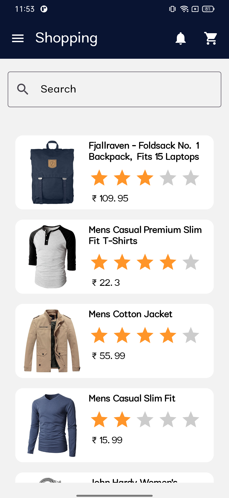

## JetpackComposeSample

**Jetpack Compose Android Apps** aims to be the starting point for developers to find an Android app with a Jetpack Compose suite of libraries.

Jetpack Compose Sample with UI and APIs is a modern toolkit for building native Android user interfaces. It simplifies and accelerates UI development with less code, powerful tools, and intuitive Kotlin APIs. This declarative framework allows developers to easily create and manage UI components, ensuring a seamless and responsive user experience.

## Features Used

- JetPack Compose
- Kotlin
- Compose AppToolbar
- MVVM
- Retrofit
- Medium complexity
- Resource loading
- Custom layouts

## Sample UIs

<table>
  <tr>
    <td></td>
    <td></td>
    <td></td>
  </tr>
  <tr></tr>
  <tr>
    <td></td>
    <td></td>
  </tr>
 </table>

## License

We have made these icons available for you to incorporate into your products under the [Apache License Version 2.0](https://www.apache.org/licenses/LICENSE-2.0.txt). Feel free to remix and re-share these icons and documentation in your products.
We'd love attribution in your app's *about* screen, but it's not required.
